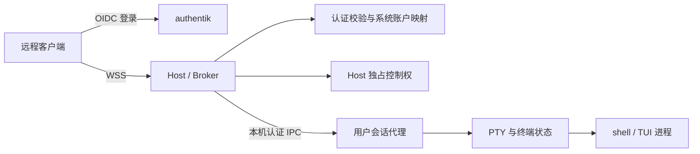

# 组件架构

## 运行结构

## 代码组织

解决方案包含一个产品项目 `src/WorkspaceAccessHost.csproj`、一个测试项目 `WorkspaceAccessHost.Tests` 和一个 NUKE 构建项目 `Build`。产品代码直接在 `src/` 下通过目录和命名空间组织职责：

| 产品目录 | 职责 |
| --- | --- |
| `Core/` | 共享模型、平台描述和契约 |
| `Authentication/` | 外部身份、认证与系统账户映射 |
| `Connections/` | 连接控制权、接管和工作区归属 |
| `Terminals/` | PTY 契约、终端状态与输入输出 |
| `Platforms/Windows/` | Windows 平台策略及 ConPTY、用户令牌、命名管道的实现位置 |
| `Platforms/Linux/` | Linux 平台策略及 PTY、UID/GID、Unix socket 的实现位置 |
| `Hosting/` | 服务生命周期、网络入口、连接仲裁和健康检查 |
| `Agent/` | 用户上下文中的终端、子进程和画面状态 |

领域逻辑依赖接口与共享模型，系统调用集中在对应平台目录，入口负责注册平台实现。

## 程序角色

同一套发布产物以 `WorkspaceAccessHost host` 运行服务宿主，以 `WorkspaceAccessHost agent` 运行用户代理。Windows 可执行文件带 `.exe` 扩展名。角色参数后的选项传递给对应宿主构建器；无参数或 `--help` 显示使用方式，未知角色以退出码 2 结束。

Host 和 Agent 分别运行在服务账户与目标用户上下文中，各自拥有进程生命周期，通过本机 IPC 协作。测试与 NUKE 项目承担验证和开发控制职责。

## 生命周期和信任边界

authentik 身份、broker 连接、系统登录上下文、工作区和终端拥有独立标识。客户端的系统用户名是授权请求；最终账户由服务端映射规则确定。

代理 IPC 需要验证对端的系统身份、目标用户、host 实例和协议版本。Windows 使用命名管道 ACL，Linux 使用 socket 文件权限与对端凭据。代理仅接受经验证的 broker 指令。

broker 使用服务账户运行。Windows 用户代理通过目标用户登录启动；Linux 启动组件负责完成组、用户和会话设置后交给用户代理。系统身份切换保持在明确的本机接口中。

首期 broker 进程生命周期是连接控制状态的边界。用户代理在 WebSocket 断开时持续存在；broker 重启后的代理重新登记、归属恢复与控制权版本同步需要完成集成验收。

## 终端契约

`IPtySessionFactory` 在已建立的用户上下文中启动终端。`IPtySession` 提供输入、输出、尺寸变更、退出状态和显式终止。工作区管理器拥有会话，传输关闭只解除附着。

代理持续消费输出，维护有容量上限的历史和终端状态。快照与输出序列号形成重连边界，输出积压策略由协议规定。
