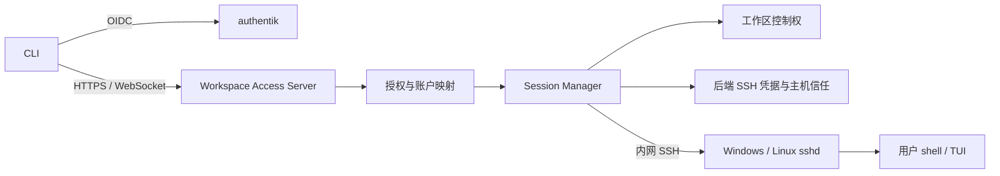

# 组件架构

## 目标链路

Server 对每个工作区持有一条后端 SSH 会话。WebSocket 只是客户端附着；断开时 Server 继续读取 SSH 输出。工作区之间有独立归属与控制权。身份由 `(issuer, subject)` 确定，系统账户由服务端映射。

## 项目组织

解决方案包含 `src/server/WorkspaceAccessServer.csproj`、`src/client/WorkspaceAccessClient.csproj`、`tests/WorkspaceAccessServer.Tests` 和 `build/Build.csproj`。Server 的 `Authentication/` 放 OIDC 配置、身份模型与授权解析，`Connections/` 放工作区控制权，`Hosting/` 放 HTTP/WebSocket 入口。`Ssh/` 已实现密码及托管私钥 SSH Broker、主机公钥校验、Session Manager 和本机诊断命令；SSH CA 与密钥实机验收仍待完成，详见[SSH 会话设计](ssh-session.md)。

CLI 的 `login` 和 `connect` 通过单一域名发现 OIDC 配置，复用 PKCE 浏览器登录与回调页，并让 Server 验证身份；`connect` 从受保护的 `/resources` 取得当前授权目标及会话状态，选择后按目标或会话 ID 的 query 建立正式 WebSocket 交互；也支持直接指定 ID。原有一次性 Linux `ls` 命令继续用于诊断。demo 和正式 Client 的真实 authentik 登录及 Server 身份验证已实测通过，正式整链路的交互验收尚待完成，见[单域名入口](client-server-transport.md)。Caddy 等反向代理可承接公网 TLS 入口；内网 `sshd` 只允许 Server 访问。Windows OpenSSH 已使用 ConPTY，因此 Server 不再自己启动 `pwsh.exe` 或实现平台 PTY。

## 信任与生命周期

OIDC 授权与 SSH 后端认证是两个边界。Server 只能为已授权的目标账户建立 SSH 会话，需校验目标主机密钥；后端 SSH 凭据不能代替外部连接的 OIDC 授权判断。若未来选择 SSH CA，还需在目标 OpenSSH 版本验收证书和账户映射。

首期断线持续性以 Server 与后端 SSH 连接存活为条件。Server 崩溃或内网 SSH 断开会失去该 SSH 终端；要跨越这一边界，未来需要目标机器上独立的会话持有者。画面恢复还需要持续消费 VT 输出、保持容量上限并生成一致的快照。

## 已有框架

`SshWorkspaceManager` 为每个工作区建立一份 `WorkspaceConnectionGate`，以不可伪造的 lease 和递增 generation 仲裁接管，并在同一临界区校验输入入队。认证、授权与账户映射完成后才可调用该核心。Data/ 已实现 PostgreSQL 管理模型与迁移，Authentication/SshAccessResolver 通过一次 LINQ 查询解析授权和目标信任配置，见[数据库](database.md)。当前已有 OIDC、内部 SSH 和 WebSocket 的首版集成；托管密钥的真实 SSH 连接与正式端到端环境验收仍待完成，见[交付状态](implementation-status.md)。
